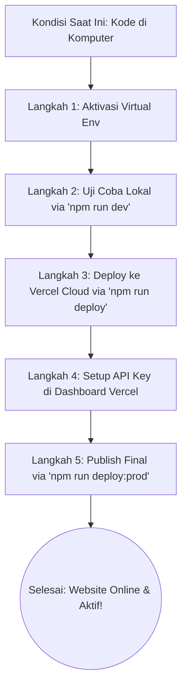

# Alur Kerja & Panduan Deploy A.T.O.M.

Berikut adalah gambaran alur kerja dari kondisi proyek saat ini hingga website Anda aktif di internet (Vercel).

---

## 🗺️ Peta Alur Kerja (Workflow)



---

## 📋 Detail Langkah Demi Langkah

### Langkah 1: Aktifkan Lingkungan Python (Virtual Environment)
Sebelum menjalankan website, terminal Anda harus berada di dalam lingkungan Python proyek (`.venv`).
1. Buka PowerShell di VS Code.
2. Jalankan perintah bypass ini agar Windows mengizinkan aktivasi script:
   ```powershell
   Set-ExecutionPolicy -ExecutionPolicy Bypass -Scope Process
   ```
3. Aktifkan dengan mengetik:
   ```powershell
   .venv\Scripts\Activate.ps1
   ```
   *(Pastikan muncul tanda `(.venv)` di sebelah kiri input terminal Anda).*

---

### Langkah 2: Uji Coba Lokal (Website + AI)
Sekarang Anda bisa menjalankan seluruh website (HTML + API) hanya dengan perintah NPM standar:
1. Ketik perintah berikut di terminal:
   ```bash
   npm run dev
   ```
2. Buka browser dan akses **[http://localhost:8000](http://localhost:8000)**.
3. Anda bisa mencoba chat secara lokal untuk memastikan semuanya berfungsi dengan baik.
4. Tekan `CTRL + C` di terminal untuk mematikan server lokal jika sudah selesai.

---

### Langkah 3: Upload Pertama ke Vercel
Setelah pengetesan lokal sukses, unggah proyek Anda ke server Vercel:
1. Pastikan Anda sudah menginstal Vercel CLI dengan mengetik: `npm install -g vercel`.
2. Ketik perintah deploy:
   ```bash
   npm run deploy
   ```
3. Ikuti pertanyaan di terminal (Tekan **Enter** terus untuk memilih opsi default).
4. Vercel akan memberikan link website sementara (preview link).

---

### Langkah 4: Masukkan API Key di Dashboard Vercel
Agar AI di website online Anda bisa berpikir, Vercel membutuhkan API Key Anda:
1. Buka browser dan masuk ke akun **Vercel** Anda.
2. Pilih proyek **project-atom**.
3. Masuk ke tab **Settings** > **Environment Variables**.
4. Tambahkan API Key berikut (ambil nilainya dari file `.env` lokal Anda):
   * **Key:** `GROQ_API_KEY` | **Value:** *[Isi dengan API Key Groq Anda]*
   * **Key:** `GOOGLE_API_KEY` | **Value:** *[Isi dengan API Key Google Gemini Anda]*
   * **Key:** `MONGODB_URI` | **Value:** *[Isi dengan connection string MongoDB Atlas Anda]*
5. Klik **Save**.

---

### Langkah 5: Publikasikan Secara Final
Terapkan API Key yang baru saja Anda masukkan agar website online Anda aktif sepenuhnya:
1. Kembali ke terminal VS Code Anda.
2. Jalankan perintah rilis produksi:
   ```bash
   npm run deploy:prod
   ```
3. **Selesai!** Vercel akan memberikan tautan (URL) produksi yang aktif selamanya. Anda bisa membukanya di HP atau membagikannya ke orang lain.
